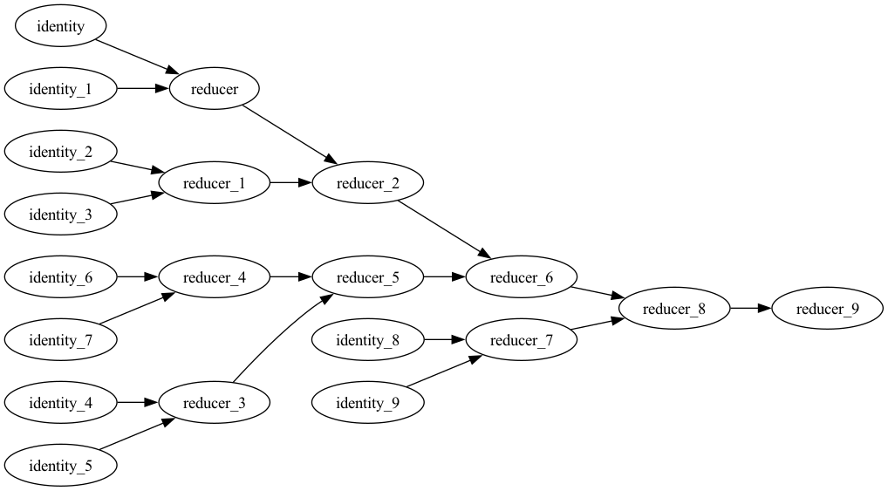

# Functional Wrapper over ray framework
[](https://opensource.org/licenses/MIT) [](https://badge.fury.io/gh/yogeshsajanikar%2Frayfun)

This is a functional wrapper over [ray](https://ray.io) framework using [`returns`](https://returns.readthedocs.io) package. The returns package provides an idiomatic way of writing type classes such as Functor, Applicative, and Monad. The `ray` framework allows embedding a value as an [ObjectRef](https://docs.ray.io/en/latest/ray-core/objects.html) and a function as a [RemoteFunction](https://docs.ray.io/en/latest/ray-core/api/doc/ray.remote.html). This package combines it together in a `RayContext`.

```python
from rayfun.types import RayContext, RayNode

int_ref: RayContext[int] = RayContext.from_value(1)
```

You can also wrap a function in the `RayContext` and call it remotely.

```python
from rayfun.types import RayContext, RayNode
from typing import Callable

def add(a: int, b: int) -> int:
    return a + b

add_ref: RayContext[Callable[[int, int], int]] = RayContext.from_value(add)
```

## Supported Type Classes
The `RayContext` is defined as a [Kind1["RayContext", _T]](https://sobolevn.me/2020/10/higher-kinded-types-in-python) type. This allows us to support [type classes](https://returns.readthedocs.io/en/latest/pages/interfaces.html) provided by `returns`.

### Mappable aka Functor

```python
from rayfun.types import RayContext, RayNode

int_ref: RayContext[int] = RayContext.from_value(1)

int_ref.map(lambda x: x + 1) # RayNode[int] = RayContext.from_value(2)
```

Internally, `map` uses `Applicative` to `apply` the function by first lifting it to `RayContext` by using `RayContext.from_value`. Thus `ray_value.apply(RayContext.from_value(function))` and `ray_value.map(function)` are equivalent.

### Applicative

`RayContext.from_value` is equivalent to `pure`. It lift the value to the `RayContext`. It can lift values, functions (including functions with variable arguments). Note that the `**kwargs` is not supported and may not be supported in the future.

```python
from rayfun.types import RayContext, RayNode
from typing import Callable

add = lambda x, y: x + y

int_ref: RayContext[int] = RayContext.from_value(1)
int_ref_1: RayContext[int] = RayContext.from_value(2)

add_ref: RayContext[Callable[[int, int], int]] = RayContext.from_value(add)

int_ref_1.apply(int_ref.apply(add_ref)) # RayNode[int] = RayContext.from_value(2)
```

#### Lazy Computation
The above calculation first create two ray objects pointing to 1 and 2 respectively. And it then lifts the function `add` to a ray remote function. Finally, it is possible to apply the add function to its arguments in two steps as shown above. The `apply` method is equivalent to `ap` in Haskell. The above method provide a way to create a computation using `ray` as a context. Note that in both `Mappable` and `Applicative` cases, the computation is not immediately performed. The result of the application (or using `apply`) is a either a partially applied function or a `FunctionNode` that represents a DAG for the computation. 

The DAG can be then executed using `RayContext.run` method. The `run` method reduces the DAG to a single value. You will be mostly interested in the reducing the value to an `ObjectRef`. You can further get the value from the `ObjectRef` using `ray.get` method. The following example showcases it. You can also plot the DAG by using `RayContext.plot` method. Note that you need to have `pydot` installed for this to work.

```python
from rayfun.types import RayContext, RayNode
from typing import Callable
import ray

add = lambda x, y: x + y
int_ref: RayContext[int] = RayContext.from_value(1)
int_ref_1: RayContext[int] = RayContext.from_value(2)

add_ref: RayNode[Callable[[int, int], int]] = RayContext.from_value(add)
lazy_node = int_ref_1.apply(int_ref.apply(add_ref)) # ObjectRef[int] = ObjectRef(2)

node = lazy_node.run() # ObjectRef[int] = ObjectRef(2)
lazy_node.plot('dag.png')
ray.get(node.wrapped) # 3
```

The DAG for the above computation looks like this.


which simply tells us that the computation running a function. Each node in the DAG represents a computation.

#### Parallel Computation
Using the above method, we can also run the computation in parallel. The following example shows how to do it.

```python
from rayfun.types import RayContext, RayNode
from typing import Callable
import ray

add = lambda x, y: x + y
int_ref_1: RayContext[int] = RayContext.from_value(1)
int_ref_2: RayContext[int] = RayContext.from_value(2)
int_ref_3: RayContext[int] = RayContext.from_value(3)
int_ref_4: RayContext[int] = RayContext.from_value(4)

add_ref: RayContext[Callable[[int, int], int]] = RayContext.from_value(add)

intermediate_node_1 = int_ref_1.apply(int_ref_2.apply(add_ref))
intermediate_node_2 = int_ref_3.apply(int_ref_4.apply(add_ref))

result_node = intermediate_node_1.apply(intermediate_node_2.apply(add_ref))
result_node.plot('dag1.png')
result = result_node.run() # ObjectRef[int] = ObjectRef(10)
ray.get(result.wrapped) # 10
```

The DAG for the above computation looks like this.


This clearly shows that the computation is now done in two stages. Note that these computations are distributed in the cluster and will run in parallel in the `ray` cluster.

### Bindable aka Monad

The `Bindable` or Monad enforces an explicit sequencing of the computation. The `RayContext` provides a `bind` method to do this. The `bind` method is equivalent to `>>=` in Haskell. The following example shows how to use it.

```python
from rayfun.types import RayContext, RayNode
from typing import Callable
import ray

square = lambda x: RayContext.from_value(x * x)
int_10 = RayContext.from_value(10)

int_10.bind(square) # RayNode[int] = RayContext.from_value(100)
``` 

The above computation will not produce a graph with two computations. Instead, it will produce a graph with just one computation that involves squaring a value. It will fetch the value from `int_10`, feeds it to the `square` function and returns the result. It enforces that a computation must be completed before starting with another. This is useful when you want to run a computation in a sequence. In short, `Applicative` for a parallel computation, and `Monad` for a sequential computation.

### Parallel reduce 
This method allows using `Applicative` to create a reduction DAG. The following example shows how to do it.

```python
from rayfun.types import RayContext, RayNode, from_iterable, parallel_reduce
from typing import Callable
import ray

inputs = range(10)
expected = sum(inputs)

def reducer(a, b):
    return a + b

def identity(a):
    return a

ray_inputs = from_iterable(inputs)
actual = parallel_reduce(
    ray_inputs, 
    RayContext.from_value(0), 
    RayContext.from_value(identity), 
    RayContext.from_value(reducer))

actual.plot('dag2.png')
result = actual.run() # ObjectRef[int] = ObjectRef(45)

```

The above computation will produce a DAG that looks like this.



It clearly shows the lazy computation represented by DAG. Combining the `Applicative`, `Functor` and `Monad` it is thus possible to declaratively define a computation and then run it in the cluster.


